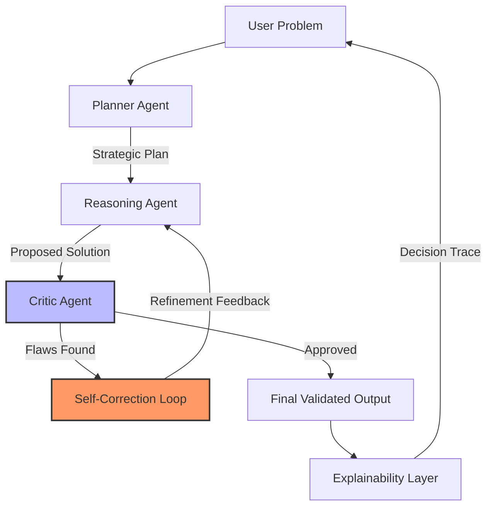

# 🤖 NEXUS-AI: Autonomous Multi-Agent Decision System

NEXUS-AI is a high-performance **Multi-Agent Orchestration System** designed to solve complex, multi-step problems through decentralized reasoning.

Unlike standard LLM chat systems, NEXUS-AI simulates a **professional team environment** where specialized AI agents collaborate, audit, and autonomously refine solutions.

---

## 🚀 Key Features

- **Collaborative Multi-Agent Flow**  
  Planner, Reasoning, and Critic agents work together autonomously.

- **Autonomous Self-Correction**  
  A Critic agent audits outputs and triggers replanning if flaws are detected.

- **Explainable AI (XAI)**  
  Transparent decision tracing through an Explainability Layer.

- **Ultra-Low Latency**  
  Optimized for **Groq LPU hardware** enabling near-instant inference.

---

## 🛠️ Technology Stack

- **Core Model:** Llama 3.3 70B  
- **Agent Framework:** LangChain  
- **Frontend:** Streamlit + Custom CSS  
- **API Provider:** Groq Cloud (LPU Acceleration)  
- **Language:** Python 3.10+

---

## 📊 System Workflow

---

## Setup & Installation
1. Clone the Repository
   git clone https://github.com/Romyyy0x786/NEXUS-AI.git
   cd NEXUS-AI

2.Install Dependencies:
   pip install -r requirements.txt

3.GROQ_API_KEY=your_key_here

4.Launch the Interface:
  python -m streamlit run interface.py

---

## 📂Project Structure

NEXUS-AI/
├── .env                 # Secret API Keys (Groq, etc.)
├── .gitignore           # Files to exclude from GitHub
├── README.md            # Project Documentation
├── requirements.txt     # Python dependencies
├── interface.py         # Streamlit Frontend (Dark Theme UI)
├── main.py              # Agent Logic & Orchestration Engine
└── core/
    ├── agents.py        # Agent prompts & personas
    └── utils.py         # Helper functions for XAI & Deep Explain

  
